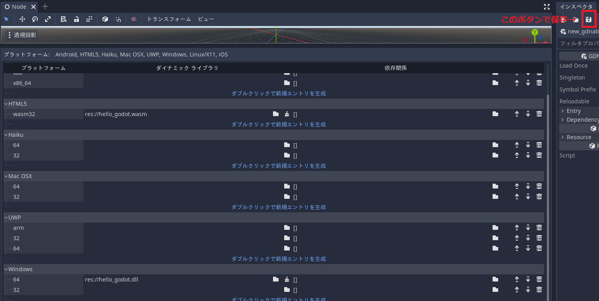
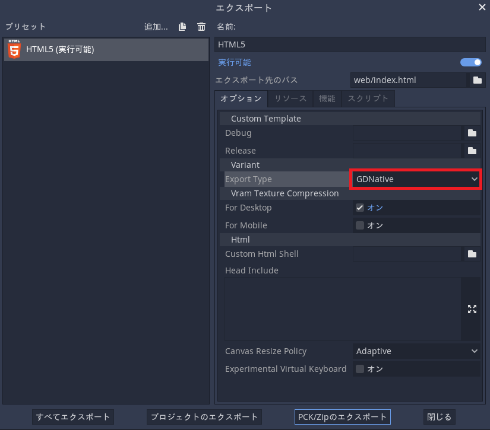

`gdnative` クレートを使用してRustでGDNativeのWebAssemblyライブラリを作成するための環境を提供するDockerfile群になります。

この環境を使用することでRustで書かれたGodotゲームのプログラムをWeb向けにコンパイルできます。

- gdnative: https://github.com/godot-rust/godot-rust
- 参考にさせていただいたサイト
    - [Support wasm32-unknown-emscripten target · Issue #647 · godot-rust/godot-rust](https://github.com/godot-rust/godot-rust/issues/647)
    - [orion78fr/godot_keepass_rust_totp@4e74a12](https://github.com/orion78fr/godot_keepass_rust_totp/actions/runs/900998393/workflow#L255)

RustやDocker、Godotはインストール済みであるものとします。

試した環境は

- WSL
- cargo v1.54.0
- Docker for Windows v4.3.0
- Godot v3.3.4, v3.4.1 (スクショはv3.4.1のものになります)

になります。

ハンズオン形式で使い方の解説をします。次のようにしてRustプロジェクトを用意してください。

```bash
$ cargo new --lib hello_godot
$ cd hello_godot
```

ファイルを以下のように書き換えます (内容は https://github.com/godot-rust/godot-rust から引用しました。)

```rust:Cargo.toml
[package]
name = "hello_godot"
version = "0.1.0"
edition = "2018"

[dependencies]
gdnative = "0.9.3"
```

```rust:src/lib.rs
use gdnative::prelude::*;

#[derive(NativeClass)]
#[inherit(Node)]
pub struct HelloWorld;

#[methods]
impl HelloWorld {
    fn new(_owner: &Node) -> Self {
        HelloWorld
    }

    #[export]
    fn _ready(&self, _owner: &Node) {
        godot_print!("Hello, world.");
    }
}

fn init(handle: InitHandle) {
    handle.add_class::<HelloWorld>();
}

godot_init!(init);
```

# Dockerfile

このリポジトリのルートディレクトリに置いてある方のDockerfileはwasmライブラリを生成するものです。

Docker Hub URL: https://hub.docker.com/repository/docker/namnium1125/godot-rust-wasm

Cargoのプロジェクトディレクトリのルートに居る状態で次のコマンドを打ってください。(あるいは`"$(pwd)"`の部分が対象プロジェクトディレクトリとなるようにしてください。)

```bash
$ docker run -it --mount type=bind,source="$(pwd)",target=/project namnium1125/godot-rust-wasm
```

すると、 `target/wasm32-unknown-emscripten/release/hello_godot.wasm` というファイルが生成されます。これが目的のファイルとなりますので、Godotのプロジェクトフォルダに移動させて活用してください。

# all_in_one_win/Dockerfile

こちらはwasmだけではなくWindowsの動的ライブラリ(`.dll`)も生成できるコンパイル環境になります。

先ほどとは異なり、VSCodeの拡張機能 `Remote - Containers` との併用を想定しています。予め入れておいてください。

Docker Hub URL: https://hub.docker.com/repository/docker/namnium1125/godot-rust-win

Cargoのプロジェクトルートに `.devcontainer` ディレクトリを作成し、 `devcontainer.json` に本イメージを指定します。

```bash
$ mkdir .devcontainer
$ echo '{"image": "namnium1125/godot-rust-win"}' > .devcontainer/devcontainer.json
```

その後、左下のコンテナ接続関連の緑色のボタン?より、 `Reopen in Container` を選択します。するとプロジェクトルートごと環境に入ることができます。

```bash
$ dll_compile
```

で、すぐに `.dll` へのコンパイルが可能です。コンパイル後は `target/x86_64-pc-windows-gnu/release/hello_godot.dll` に目的のファイルがあります。 `.wasm` の場合と同様に、この動的ライブラリをGodotのプロジェクトフォルダに移動させて活用してください。

```bash
$ wasm_compile
```

の方を実行すると、先程同様に `hello_godot.wasm` が生成されます。

# `.wasm` 、 `.dll` が適切に作成されたかの確認

Godotにて、エクスポート用にHTML5用等のテンプレートをインストールします。(https://docs.godotengine.org/en/stable/getting_started/step_by_step/exporting.html)

以下の操作を順に行っていきます。( [Godot EngineからRustを呼ぶ](https://zenn.dev/kawaxumax/articles/e0dedf3f6d4219) なども参考にしてください)

1. Godotのプロジェクトを用意し、`Node` 型のルートノードを含むシーンを用意してください。
2. 動的ライブラリを導入するためにファイルシステムタブで右クリック→ `新規リソース` → `GDNativeScript`から `.gdnlib` ファイルを用意します( `.tres` から変更します。 `.tres` との違いはあまり無いみたい...?)。名前は好きなものでよいのでここではデフォルトの `new_gdnativelibrary.gdnlib` とします。
3. 前節までで作成した動的ライブラリを対応するプラットフォームに指定します。指定後**必ずインスペクタにある保存ボタンでnew_gdnativelibrary.gdnlibファイルを保存**してください。
    - `.wasm`: `HTML5 wasm32`
    - `.dll`: `Windows 64`



4. ルートノードにスクリプトをアタッチします。言語を `NativeScript` 、クラス名を `HelloWorld` にしておきます。 `Node.gdns` のようなファイルが生成されます。
5. アタッチしたスクリプトのインスペクタにある `NativeScript` → `Library` に先程用意した `new_gdnativelibrary.gdnlib` を指定します。その後、 `Node.gdns` の方を保存します。
6. `Node.tscn` を保存し、メインシーンに指定します。

ここからの確認方法は分岐します。

## `.dll` の場合

通常通り実行してコンソールに `Hello, world.` と表示されていれば無事にコンパイルが完了しています。

## `.wasm` の場合

実際にHTMLにエクスポートして確かめます。

プリセットに `HTML5` を追加し、Export Typeに `GDNative` を指定した後、「プロジェクトのエクスポート」をクリックしてエクスポートします。(エクスポート先では新たなディレクトリを作成してエクスポートすることを推奨します。また名前も `index.html` にしておくと楽です。)



その後例えば `python3 -m http.server` などのコマンドを使用してディレクトリをホストし、ブラウザを起動してアクセスしてみます。デベロッパーツールの出力に `Hello, world.` と表示されていれば無事にコンパイルが完了しています。